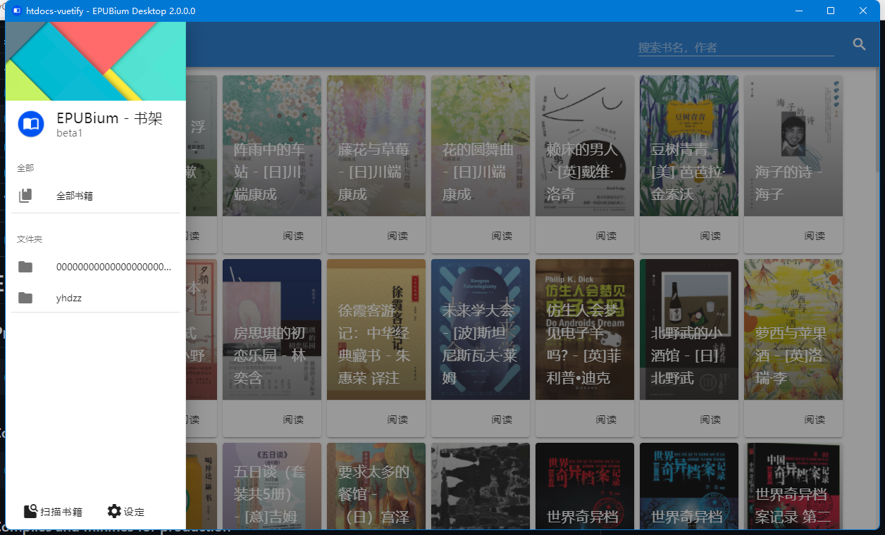
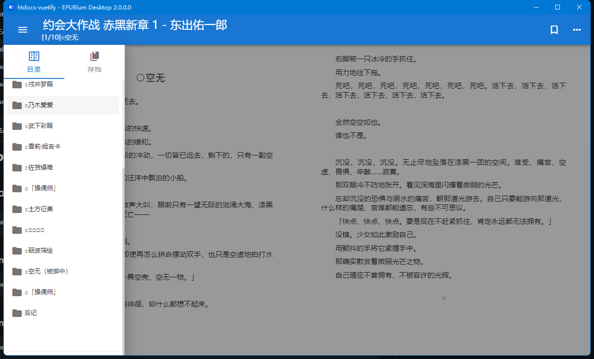

# EPUBium material design 主题包，基于 vuetify。


## 预览




EPUBium 项目来自 [【ZYFDroid】](https://github.com/ZYFDroid) 的 [EPUBiumDesktop](https://github.com/SwetyCore/EPUBiumDesktop)

## Project setup
```
npm install
```

### Compiles and hot-reloads for development
```
npm run serve
```

### Compiles and minifies for production
```
npm run build
```

### Lints and fixes files
```
npm run lint
```

### Customize configuration
See [Configuration Reference](https://cli.vuejs.org/config/).
